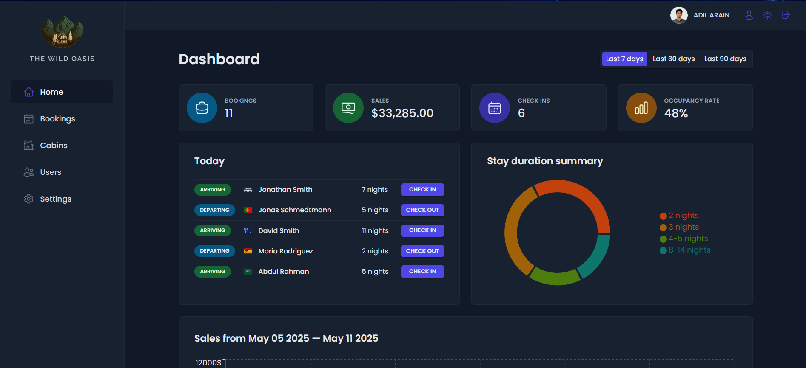

# 🌴 Wild Oasis – Hotel Management Dashboard

<!-- Add screenshots or a demo GIF here if available -->

## 📖 Description

**Wild Oasis** is a modern and responsive hotel management dashboard built with the power of **React** and **Supabase**. It allows hotel staff to manage bookings, track guests, and monitor key performance metrics — all from a sleek and intuitive interface. Designed with real-world use in mind, this project includes authentication, dynamic forms, chart visualizations, and theme toggling to provide a complete hotel management experience.

Whether you're managing room availability or reviewing booking stats, Wild Oasis streamlines your workflow and enhances productivity.

## 🧩 Features
- 🔐 Secure login with Supabase authentication  
- 📋 Guest booking and management  
- 📊 Interactive dashboard with charts and statistics  
- 🌙 Dark mode support  
- ✅ Robust form validation using React Hook Form  
- 🔄 Real-time data fetching and state management with React Query  
- 🧠 Centralized state handling using Context API

## 🛠 Tech Stack
- **Frontend:** React, Styled Components, React Hook Form, React Query, Context API  
- **Backend:** Supabase (Database + Auth + API)  